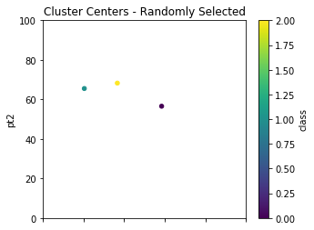
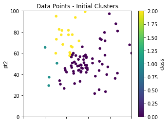
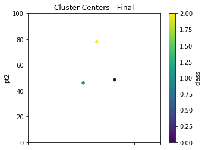
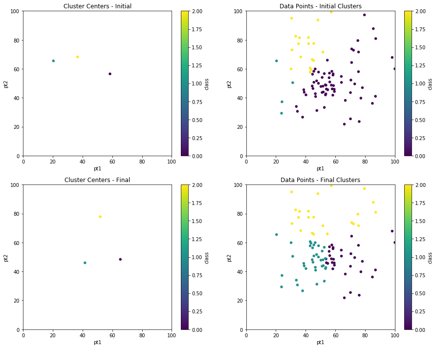

Hello Everyone!
It's a cool -2F here in the windy city. I grabbed my coffee and set out to build the KMeans Clustering algorithm from scratch using NumPy and Pandas.

As a refresher KMeans is an unsupervised clustering algorithm. The general methodology goes as follows:

1. Define the number of target clusters.
2. Randomly select cluster centers from the data pool.
3. Do 1-Nearest Neighbor to classify all the other points to defined centers.
4. Average those points classified together to redefine the new cluster center points.
5. Repeat 3-4 a reasonable amount of times

Alright, let us get into the details.

Start by doing your imports. In this notebook I will be using the `plot.scatter` functionality of Pandas which runs `matplotlib` under the hood, so we will drop in the `inline` display tweak for jupyter notebooks.


```python
import numpy as np
import pandas as pd
from matplotlib import pyplot as plt
%matplotlib inline
```

##### Function Definitions

`make_blob`: Used to create randomly generated floats of data to give the exercise a basic foundation of clusters. `r1` and `r2` are the bounds, `d` is the dimensionality (we're doing 2 dimensions), and `p` is the number of points we want.


```python
def make_blob(r1,r2,d,p):
    return [(r2-r1)*np.random.random_sample((d,))+r1 for i in range(p)]
```

`initialize_KMeans_Centers`: When starting out we do not have cluster centers defined. The methodology calls for randomly selecting cluster centers. We will pass in our dataframe of points and `c` is the number of clusters we're defining. Using NumPy's `random.choice` function we select `c` number of items between 0 and `len(df)` which represents our range in the dataframe. We then reindex `centers` as a stanalone dataframe and set the `class` to it's `index`. It makes a good unique identifier.


```python
def initialize_KMeans_Centers(df, c):
    centers = df.iloc[np.random.choice(len(df),c,False)].copy()
    centers.reset_index(inplace=True, drop=True)
    centers['class'] = centers.index
    return centers
```

`nearest`: This function is essentially the kNN algorithm but it only retrieves the 1-Nearest item's classification. Each point `p` in our dataframe will go through and determine which of the cluster centers `c` it is closest too and retrieve that classification.


```python
def nearest(p,c):
    point = p['pt1':'pt2']
    clsf = sorted([[np.linalg.norm(point-item[1]['pt1':'pt2']),item[1]['class']] for item in c.iterrows()])[0][1]
    return clsf
```

`classify`: This function is what calls the nearest function across all the data points in the dataframe using Pandas' `apply` the `nearest` function to our dataframe points and faciliated using a `lambda` expression.


```python
def classify(df,ctrs):
    df['class'] = df.apply(lambda x: nearest(x,ctrs),axis=1)
    return df
```

`new_centers`: This performs very similar functionality as `initialize_KMeans_Centers` except that this step happens in the subsequent looping part of the algorithm when we are averaging clusters that were classified together to determine new cluster centers. Pandas' `groupby` allows us to group by the classifications we have assigned and returns the `mean` for the `pt1` and `pt2` columns in the dataframe giving us new cluster centers.


```python
def new_centers(df):
    centers = df.groupby('class').mean()
    centers.reset_index(inplace=True, drop=True)
    centers['class'] = centers.index
    return centers
```

##### Initialize KMeans

Alright, that was the hard part. Now let us setup the example. Here we are defining that we want to find 3 `clusters`. For simplicy and ease of visualization we are using 2 dimensions (x and y), but these dimensions will be based on your real world data which can extend hundereds of dimensions. `npts` is the number points we will generate per blob, and in this example I am  making 3 blobs because I'm seeking 3 clusters. Again, this is just random data for demonstration purposes. Finally, cycles defines how many times I want to re-average the clusters and re-classify the points. You would adjust this number based on your time, resource, and accuracy constraints and needs.


```python
clusters = 3
dims = 2
npts = 30
np_pts = make_blob(30,100,dims,npts) + make_blob(20,80,dims,npts) + make_blob(40,60,dims,npts)
cycles = 5
```

Here we take our random data which was created in NumPy and convert it into a dataframe `dfpts`. We will also create a `class` column that will act as a placeholder for our future classification activity.


```python
dfpts = pd.DataFrame(np_pts,columns=['pt1','pt2'])
dfpts['class'] = 0
```

We initialize our first pass center points by randomly selecting from our dataframe using the `initialize_KMeans_Centers` function call. This will be the only time we use this function.


```python
centers = initialize_KMeans_Centers(dfpts, clusters)
centers
```


<div>
<style scoped>
    .dataframe tbody tr th:only-of-type {
        vertical-align: middle;
    }

    .dataframe tbody tr th {
        vertical-align: top;
    }

    .dataframe thead th {
        text-align: right;
    }
</style>
<table border="1" class="dataframe">
  <thead>
    <tr style="text-align: right;">
      <th></th>
      <th>pt1</th>
      <th>pt2</th>
      <th>class</th>
    </tr>
  </thead>
  <tbody>
    <tr>
      <th>0</th>
      <td>58.464219</td>
      <td>56.550959</td>
      <td>0</td>
    </tr>
    <tr>
      <th>1</th>
      <td>20.420278</td>
      <td>65.507434</td>
      <td>1</td>
    </tr>
    <tr>
      <th>2</th>
      <td>36.677532</td>
      <td>68.242436</td>
      <td>2</td>
    </tr>
  </tbody>
</table>
</div>


Using the `classify` function we previously defined we pass in our data frame of points and the cluster centers and `classify` will attach a classification to each of our data points. If you review the function above you will see this is done via the Panda's `apply` and `lambda` approach and calling `nearest` on each data point.


```python
dfpts = classify(dfpts,centers)
```

##### Plot the Initial Pass

Ok, great, so we have now initialized everything up to providing the data points their first classification. Let us look at some visuals so we can see what is going on. We will use Panda's `plot.scatter` on the randomly selected cluster centers `centers.plot.scatter` and also on our data points `dfpts.plot.scatter`.


```python
init_centers = centers.copy()
init_centers.plot.scatter(x='pt1',y='pt2',c='class',\
                     colormap='viridis',figsize=(5,4),\
                     xlim=(0,100),ylim=(0,100),title="Cluster Centers - Randomly Selected");
```


<p align="center">
  </p>


```python
init_pts = dfpts.copy()
init_pts.plot.scatter(x='pt1',y='pt2',c='class',\
                     colormap='viridis',figsize=(5,4),\
                     xlim=(0,100),ylim=(0,100),title="Data Points - Initial Clusters");
```


<p align="center">
  </p>

##### Iterating to Final Clusters

As previously mentioned, we randomly select our initial starting points to cluster on, but the results are not final until we take multiple passes to achieve a more robust clustering solution. We had previously defined in our setup `cycles` as 5. This loop calls `new_centers` and `classify` over and over to re-average and re-classify our clusters. With real world data, something you may want to try is storing the results of the cluster centers over the iterations and finding the point at which the change in those averages becomes negligible.


```python
for times in range(cycles):
    centers = new_centers(dfpts)
    dfpts = classify(dfpts,centers)
    
```


```python
centers.plot.scatter(x='pt1',y='pt2',c='class',\
                     colormap='viridis',figsize=(5,4),\
                     xlim=(0,100),ylim=(0,100),title="Cluster Centers - Final");
```


<p align="center">
  </p>


```python
dfpts.plot.scatter(x='pt1',y='pt2',c='class',\
                     colormap='viridis',figsize=(5,4),\
                     xlim=(0,100),ylim=(0,100),title="Data Points - Final");
```


<p align="center">
  </p>

Finally, we can compare the before and after cluster centers and data point clustering using `subplots`.


```python
fig, axes = plt.subplots(nrows=2, ncols=2,figsize=(15,12))
init_centers.plot.scatter(x='pt1', y='pt2', c='class', colormap='viridis',\
                     xlim=(0,100),ylim=(0,100),title="Cluster Centers - Initial",ax=axes[0,0]);
init_pts.plot.scatter(x='pt1', y='pt2', c='class', colormap='viridis',\
                     xlim=(0,100),ylim=(0,100),title="Data Points - Initial Clusters",ax=axes[0,1]);
centers.plot.scatter(x='pt1', y='pt2', c='class', colormap='viridis',\
                     xlim=(0,100),ylim=(0,100),title="Cluster Centers - Final",ax=axes[1,0]);
dfpts.plot.scatter(x='pt1', y='pt2', c='class', colormap='viridis',\
                     xlim=(0,100),ylim=(0,100),title="Data Points - Final Clusters",ax=axes[1,1]);
```


<p align="center">
  </p>

You should know I initially set out to do this without Pandas. I quickly realized there was huge benefit in using Pandas to achieve this. I hope you enjoyed this exercise. And please reach out with any questions or feedback. Thanks for reading, and remember:

Stay Chaotic – Stay Neutral

[ARI](mailto:ari.virrey@gmail.com)


```python

```
